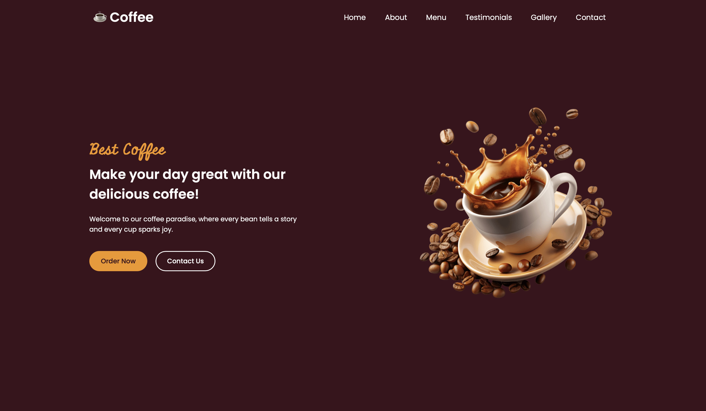
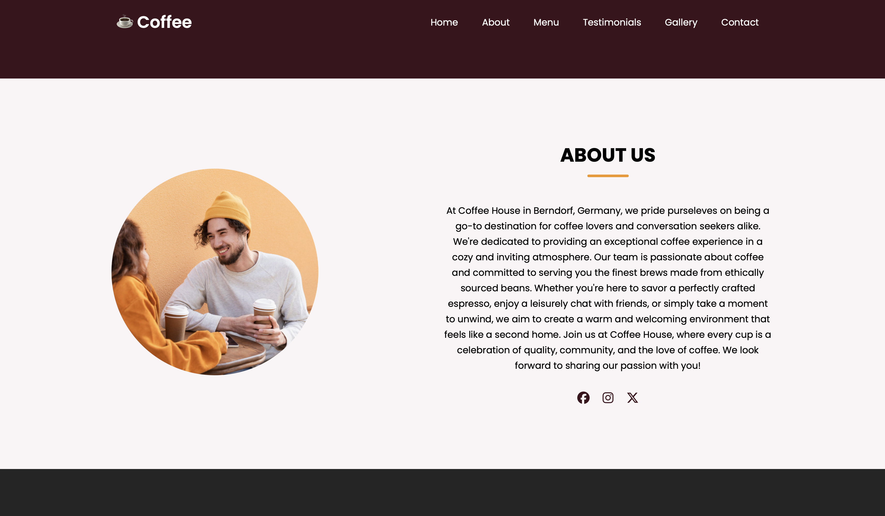
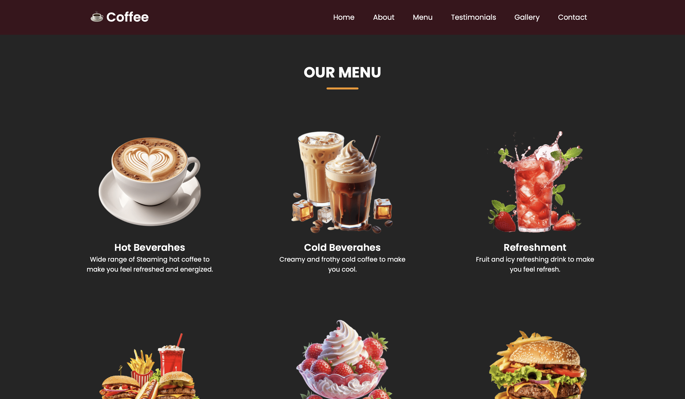
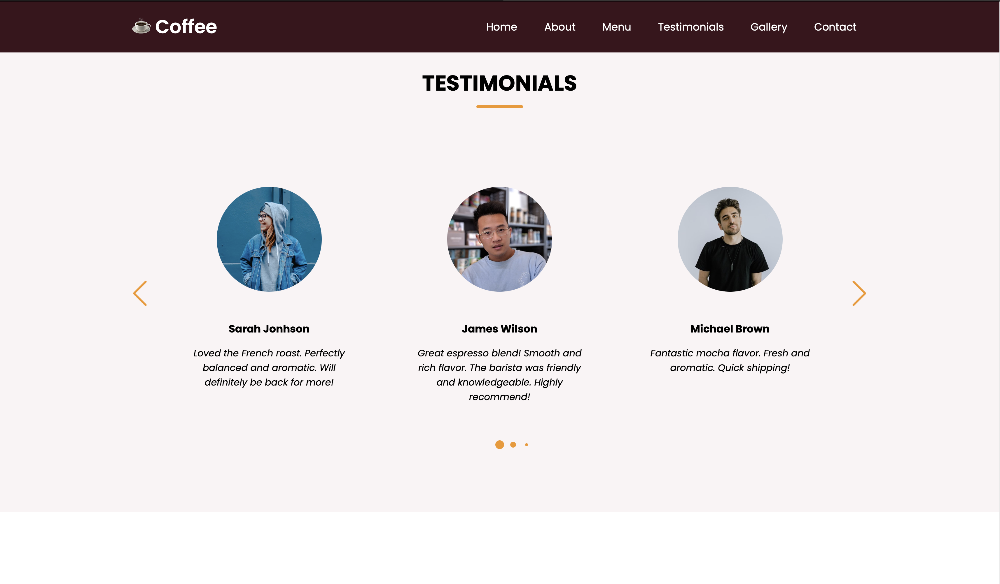
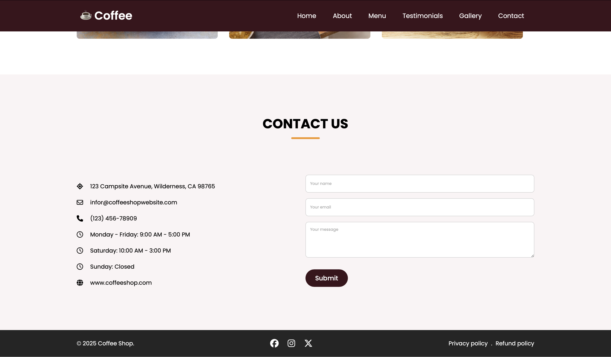
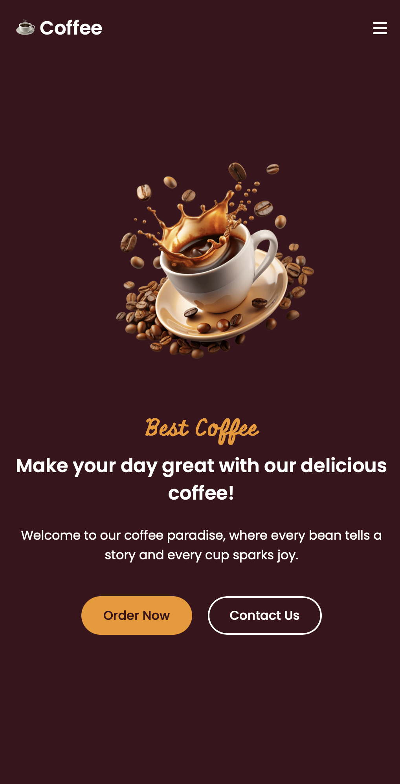

# ☕ Coffee Website

A responsive and modern coffee shop website built with HTML, CSS, and JavaScript.

## 🚀 Features

- Responsive design that works on desktop and mobile
- Interactive menu showcase
- Smooth scrolling navigation
- Product gallery
- Contact form
- Modern UI/UX design

## 💻 Technologies Used

- HTML5
- CSS3
- JavaScript
- Font Awesome Icons
- Google Fonts

## 📥 Installation

1. Clone the repository:
```bash
git clone https://github.com/MathurakshiMahendrarajah/Frontend_Projects.git
```

2. Navigate to the project directory:
```bash
cd coffee-website
```

3. Open `index.html` in your browser

## 🎨 Preview


*Modern homepage with welcoming hero section*


*About section showcasing our story and values*


*Interactive menu showcase with our signature beverages*


*Customer reviews and feedback section*


*Photo gallery featuring our coffee and ambiance*


*User-friendly contact form for inquiries*


*Mobile-responsive design demonstration*

## 📝 Usage

Feel free to use this template for your own coffee shop or restaurant website. Customize the content, colors, and images to match your brand.

## 🤝 Contributing

1. Fork the repository
2. Create your feature branch (`git checkout -b feature/AmazingFeature`)
3. Commit your changes (`git commit -m 'Add some AmazingFeature'`)
4. Push to the branch (`git push origin feature/AmazingFeature`)
5. Open a Pull Request


## 👤 Author

Your Name
- GitHub: [@MathurakshiMahendrarajah](https://github.com/MathurakshiMahendrarajah/Frontend_Projects.git)

## ⭐ Show your support

Give a ⭐️ if you like this project!
